# USDA FDC × Flavonoid 통합 데이터베이스 구축 — 결과 보고서

> 데이터베이스시스템 텀프로젝트 · 과제 A
> 본 보고서의 모든 행 수·외래키·DDL 수치는 운영 중인 MySQL `usda_fdc` 데이터베이ㅍ스와 실제 적재 스크립트에서 직접 추출했으며, 2026-06-19 라이브 재검증을 거침. 단계별 상세 로그는 [PROGRESS.md](PROGRESS.md) 및 각 `stage_*_log.md`, 한 페이지 요약은 [OVERVIEW.md](OVERVIEW.md) 참조.

## 목차

1. [프로젝트 개요](#1-프로젝트-개요)
2. [구축 과정](#2-구축-과정)
   - [Chapter 1 — DDL · ERD 설계](#chapter-1--ddl--erd-설계)
   - [Chapter 2 — CSV 적재](#chapter-2--csv-적재)
   - [Chapter 3 — xlsx 임시 테이블 적재](#chapter-3--xlsx-임시-테이블-적재)
   - [Chapter 4 — nutrient 테이블 확장](#chapter-4--nutrient-테이블-확장)
   - [Chapter 5 — food_nutrient 통합 INSERT](#chapter-5--food_nutrient-통합-insert)
   - [Chapter 6 — unmatched_flavonoid 분리](#chapter-6--unmatched_flavonoid-분리)
   - [Chapter 7 — 검증](#chapter-7--검증)
3. [고찰](#3-고찰)
4. [부록 A — 설계 결정](#부록-a--설계-결정)
5. [부록 B — 트러블슈팅](#부록-b--트러블슈팅)
6. [부록 C — 스키마 전문 (DDL)](#부록-c--스키마-전문-ddl)
7. [부록 D — 다이어그램](#부록-d--다이어그램)
8. [부록 E — 실행 가이드](#부록-e--실행-가이드)
9. [부록 F — 요구사항 · 채점 기준 대응표](#부록-f--요구사항--채점-기준-대응표)
10. [부록 G — 코드 · 스크립트](#부록-g--코드--스크립트)

---

# 1. 프로젝트 개요

## 1-1. 목표 및 핵심 과제

이 프로젝트의 목표는 USDA가 서로 다른 체계로 제공하는 두 영양 데이터셋을 하나의 관계형 데이터베이스로 통합하는 것이다. 한쪽은 일반 영양소를 담은 FDC, 다른 한쪽은 플라보노이드 함량을 담은 Flavonoid 데이터인데, 두 데이터가 식품을 가리키는 식별자가 서로 달라 그대로는 JOIN할 수 없다는 데 핵심 난제가 있다.

- **목표**: USDA가 서로 다른 체계로 제공하는 두 영양 데이터셋을 단일 관계형 DB로 통합
  - FDC(Food Data Central): 일반 영양소(단백질·칼슘·비타민 등), CSV 6종 / 약 3,100만 행
  - Flavonoid DB: 항산화 성분 함량(이소플라본·안토시아닌 등), xlsx 3시트 / 약 27만 행
- **핵심 난제**: 두 데이터의 식품 식별자 불일치
  - FDC는 전역 식별자 `fdc_id`, Flavonoid는 FNDDS 8자리 `food_code` 사용 → 직접 JOIN 불가
  - 해결: 두 체계를 모두 보유한 `survey_fndds_food`를 브릿지로 삼아 `food_code` → `fdc_id` 변환
- **최종 효용**: 한 식품의 일반 영양소와 플라보노이드 함량을 단일 SQL 조회로 통합 출력

## 1-2. 단계 구성 (7단계)

- Stage 1: DDL · ERD 설계
- Stage 2: CSV 6종 → 본 데이터 6테이블 적재 (3가지 방법 비교)
- Stage 3: xlsx 3시트 → 임시 테이블 적재
- Stage 4: 플라보노이드 영양소 37종을 `nutrient` 사전에 추가
- Stage 5: 식별자 변환 후 `food_nutrient` 통합 INSERT (과제 핵심)
- Stage 6: 변환 실패분을 사유와 함께 분리 보존
- Stage 7: 검증 5항목 추출 · 정리
- 환경: MySQL 8.0.45 / InnoDB / utf8mb4 · utf8mb4_unicode_ci / DB명 `usda_fdc`

## 1-3. 입력 데이터 (원본)

| 파일 | 행 수 | 용량 | 형식 | 대상 테이블 | 주요 특이사항 |
|---|---:|---:|---|---|---|
| food.csv | 2,085,340 | 208 MB | CSV | food | branded 95.6% / food_category_id NULL 14,554 / description NULL 9 |
| nutrient.csv | 477 | 0.02 MB | CSV | nutrient | nutrient_nbr NULL 12 / rank NULL 11 |
| food_nutrient.csv | 27,094,027 | 1,702 MB | CSV | food_nutrient | 명세 외 `percent_daily_value` 컬럼 존재 → DDL 포함 |
| survey_fndds_food.csv | 5,432 | 0.28 MB | CSV | survey_fndds_food | start_date 전부 2021-01-01 / **통합 브릿지 핵심** |
| sr_legacy_food.csv | 7,793 | 0.12 MB | CSV | sr_legacy_food | 결측 없음 / NDB_number 최대 93,600 |
| branded_food.csv | 1,993,975 | 907 MB | CSV | branded_food | ingredients 장문 → TEXT 필요 |
| USDA food flavonoid.xlsx | 37 / 7,083 / 262,071 | 6.2 MB | XLSX 3시트 | tmp_flavdesc / tmp_mainfooddesc / tmp_flavval | FLAVDESC는 명세 "38" 표기(헤더 포함), 실데이터 37 |

## 1-4. 산출물 구조 (10개 테이블)

- 본 데이터(6): `food` 루트 + `survey_fndds_food`·`sr_legacy_food`·`branded_food`(각 1:1) + `food_nutrient`(`food`·`nutrient`와 N:1, 사실 테이블)
- 임시(3): `tmp_flavdesc` · `tmp_mainfooddesc` · `tmp_flavval` (xlsx 스테이징)
- 분리(1): `unmatched_flavonoid` (독립, FK 없음)

```
본 데이터 (6) :  food ─┬─ survey_fndds_food   (1:1, 브릿지)
                       ├─ sr_legacy_food      (1:1, 보조 매핑)
                       ├─ branded_food        (1:1, 라벨 확장)
                       └─ food_nutrient ── nutrient   (N:1 / N:1, 사실 테이블)
임시 (3)     :  tmp_flavdesc · tmp_mainfooddesc · tmp_flavval   (xlsx 스테이징)
분리 (1)     :  unmatched_flavonoid   (독립, FK 없음)
```

## 1-5. 최종 결과 요약

- 총 적재 행 수: **34,402,883** (10테이블)
- FK 고아 행: **0건** (5개 관계, LEFT JOIN 검증)
- 데이터 손실: **0** (186,073 + 75,998 = 262,071, 원본 일치)
- Flavonoid 매칭률 / 실패율: **71.00% / 29.00%** (186,073 / 75,998)
- 폐기 food_code: 2,054 (2017→2021 버전 불일치)
- ※ 실패 29%는 적재 결함 아님 → 버전 시차로 인한 구조적 결과 (고찰 [3-1](#3-1-매칭률-71의-해석) 참조)

---

# 2. 구축 과정

## Chapter 1 — DDL · ERD 설계

첫 단계에서는 utf8mb4 DB를 생성하고 본 데이터 6개·임시 3개·분리 1개의 총 10개 테이블을 정의했다. 스키마를 곧바로 짜지 않고 원본 CSV·xlsx의 컬럼·타입·결측·값 범위를 EDA로 먼저 조사한 뒤 타입과 제약을 결정했으며, 이 과정에서 식별자 불일치(`fdc_id` ↔ 8자리 `food_code`)를 확인하고 `survey_fndds_food`를 브릿지로 삼는 설계 골격을 확정했다. 주요 타입·제약 결정과 그 근거는 다음과 같다. 각 결정은 모두 한 가지 대안을 두고 비교한 끝에 선택했다.

- `food.food_category_id` → VARCHAR(80): 숫자(`"1002"`)와 문자(`"Oils Edible"`)가 한 컬럼에 혼재해 INT로 받을 수 없으므로 가변 문자열로 수용
- `survey_fndds_food.food_code` → INT UNSIGNED: 최댓값 99,998,210이 INT UNSIGNED 상한(약 42억) 이내라 INT로 충분하며, BIGINT는 저장 공간 낭비라 채택하지 않음
- `percent_daily_value` DDL 포함: 명세에는 없으나 실제 CSV에 존재하는 컬럼으로, 무시하면 데이터 손실이므로 포함(NFR-06, 명세보다 실데이터 우선)
- 예약어 백틱 처리: `name`·`rank`·`min`·`max`·`median`이 MySQL 예약어와 충돌하므로 백틱으로 감싸 회피
- `nutrient`에 `is_flavonoid`·`flavonoid_class` 선반영: Stage 4에서 대용량 테이블을 ALTER하는 대신 Stage 1 DDL에 미리 두어, 통합을 ALTER 없이 INSERT만으로 처리
- `unmatched_flavonoid`만 FK 없는 독립 테이블: 매핑 실패분을 본 테이블에 강제 귀속하면 영양학적 분석이 왜곡되므로, 분리해 무결성 보존과 실패 사유 추적성을 확보(NFR-04)
- 외래키는 모두 `ON DELETE/UPDATE CASCADE`: RESTRICT 대신 CASCADE로 food를 중심으로 한 자식 테이블 일관성을 자동 유지

이렇게 해서 본 데이터 6 + 임시 3 + 분리 1 = 10개 테이블, 외래키 5개(survey·sr_legacy·branded → food, food_nutrient → food·nutrient, 모두 CASCADE), 보조 인덱스 14개를 정의했다. 인덱스는 막연히 많이 걸지 않고 실제 쿼리 부하가 걸리는 지점을 골라 부여했다. `survey_fndds_food`의 `idx_survey_food_code`는 Stage 5 통합 JOIN(`ON f.food_code=s.food_code`)을 가속하는 통합의 핵심 경로이고, `food_nutrient`의 복합 인덱스 `idx_fn_fdc_nutrient`는 검증 ⑤의 단일식품 조회와 (fdc_id, nutrient_id) 중복 검사를, `nutrient`의 `idx_nutrient_is_flavonoid`는 검증 ④·⑤의 플라보노이드 필터를, `tmp_flavval`의 `idx_tmp_food_code`는 Stage 5·6의 안티조인을, `food`의 `idx_food_data_type`은 data_type 분포 검증을 각각 빠르게 한다. 전체 테이블의 DDL 원문은 뒤의 부록 C에 그대로 수록했으며, 개념설계와 릴레이션 스키마는 `USDA_FDC_Flavonoid_설계문서.docx`에 담겨 있다.

## Chapter 2 — CSV 적재

CSV 6종은 외래키 제약을 어기지 않도록 부모→자식 순(`food → nutrient → survey_fndds_food → sr_legacy_food → branded_food → food_nutrient`)으로 적재했다. 적재 동안에는 `sql_mode=''`(빈문자열→NULL)·`unique_checks=0`·`foreign_key_checks=0`·`autocommit=0`으로 세션을 최적화하고, 끝난 뒤 외래키·행 수·NULL·분포를 검증한 다음 설정을 원복했다. 명세가 요구한 세 가지 적재 방법은 데이터 특성에 맞춰 다음과 같이 분담했다.

- LOAD DATA: food, food_nutrient — 대용량(208MB·1.7GB), 속도 최우선
- Python(csv+executemany): nutrient, survey, sr_legacy — 소용량 + LOAD가 quoted-comma 부분 누락 → 정확성
- Python(pandas chunked): branded_food — ingredients TEXT에 콤마·따옴표·줄바꿈 다수, 표준 파서 필수

방법별 실측 성능은 다음과 같다(채점 핵심).

| 방법 | 대상 | 행 수 | 파일 | 소요(s) | 행/초 | MB/s |
|---|---|---:|---:|---:|---:|---:|
| LOAD DATA | food(1차) | 2,043,540 | 208 MB | 25.09 | 81,455 | 8.29 |
| Python(보완) | food(누락) | 41,801 | — | 3.2 | 13,063 | — |
| Python | nutrient | 477 | 0.02 MB | 0.012 | 39,750 | 1.67 |
| Python | survey_fndds_food | 5,432 | 0.28 MB | 0.120 | 45,267 | 2.33 |
| Python | sr_legacy_food | 7,793 | 0.12 MB | 0.110 | 70,845 | 1.09 |
| Python pandas | branded_food | 1,993,975 | 907 MB | 866.3 | 2,302 | 1.05 |
| LOAD DATA | food_nutrient | 27,094,027 | 1,702 MB | 410.4 | 65,996 | 4.15 |

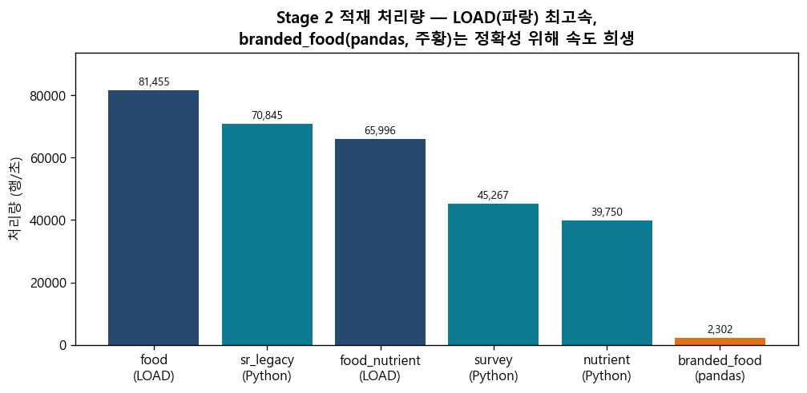

*그림 1. Stage 2 방법별 적재 처리량(행/초). LOAD DATA가 최고속이며, branded_food는 RFC4180 정확성을 위해 pandas를 써 속도를 희생했다.*

food 적재가 두 줄로 나뉜 것은 1차 LOAD에서 41,801행이 조용히 누락(silent skip)되었기 때문이다. `description` 안에 들어 있는 임베디드 줄바꿈(`\n`)을 LOAD가 행 경계로 오인한 것으로, RFC4180 표준 파서인 Python `csv.reader`로 누락된 fdc_id를 검출해 보완 INSERT하여 메웠다.

```python
# food_topup.py — LOAD가 누락한 fdc_id를 csv.reader로 검출해 보완 INSERT
import csv
loaded = set(...)  # DB에 적재된 fdc_id
with open('food.csv', newline='', encoding='utf-8') as fp:
    for row in csv.reader(fp):          # RFC4180 표준 파서 → 임베디드 newline 안전
        if row[0] not in loaded:
            cur.execute("INSERT INTO food (...) VALUES (...)", row)
# 부작용: fdc_id=0 1행 혼입 → DELETE FROM food WHERE fdc_id=0;
```

이 밖에도 Stage 2에서는 몇 가지 환경 문제를 겪고 해결했다. `LOAD DATA LOCAL`이 처음엔 거부되어 `local_infile`을 서버(`SET GLOBAL local_infile=1`)와 클라이언트(`--local-infile=1`) 양쪽에서 켰고(기본 OFF 정책), FK로 참조되는 테이블은 비어 있어도 `TRUNCATE`가 ERROR 1701로 막혀 `DELETE FROM`으로 우회했다. `mysql -e`로 LOAD하면 셸과 클라이언트의 2단계 quote 처리가 충돌해 0행이 적재되어 SQL을 파일로 분리한 뒤 `mysql < file.sql`로 리다이렉트했고, 검증 쿼리에서 `rows`가 예약어라 별칭을 `row_cnt`로 바꿨다. 소용량 테이블 역시 `"Carbohydrate, by difference"`처럼 따옴표 안에 콤마가 든 필드에서 LOAD가 일부 행을 놓쳐, 앞서 분담한 대로 Python으로 전환했다. 이런 보완을 거쳐 6개 테이블의 행 수는 모두 기대값과 일치했고(food 2,085,340 / nutrient 477 / survey 5,432 / sr_legacy 7,793 / branded 1,993,975 / food_nutrient 27,094,027), FK 고아는 0건이었다.

## Chapter 3 — xlsx 임시 테이블 적재

`USDA food flavonoid.xlsx`의 세 시트는 openpyxl로 읽으면서 CSV로 저장하는 동시에 임시 테이블에 INSERT했다. 인코딩 변환 단계를 줄이면서 CSV 산출물도 함께 확보하기 위함이다. 적재 도구로 처음부터 Python을 쓴 것은 Stage 2에서 겪은 LOAD silent skip의 교훈을 반영한 결정으로, 본문 텍스트가 섞인 xlsx는 안전한 표준 파서로 처리하는 편이 옳다고 판단했다. 시트별 적재 결과는 다음과 같다.

- FLAVDESC 37행 → `tmp_flavdesc` (0.00s)
- MAINFOODDESC 7,083행 → `tmp_mainfooddesc` (0.25s)
- FLAVVAL 262,071행 → `tmp_flavval` (9.17s)

적재 직후 Stage 5를 미리 시뮬레이션하는 의미로 `tmp_flavval`을 `survey_fndds_food`와 JOIN해 보니 matched 186,073 / unmatched 75,998로 명세와 정확히 일치했고, (food_code, nutrient_code) 중복도 0이었다. 이로써 Stage 5·6의 결과를 미리 확신할 수 있었다.

## Chapter 4 — nutrient 테이블 확장

이 단계에서는 `tmp_flavdesc`의 플라보노이드 영양소 37종을 `nutrient` 사전에 추가해 일반 영양소와 한 테이블에서 다루게 만든다. INSERT에 앞서 `tmp_flavdesc.nutrient_code`와 기존 `nutrient.id`의 교집합이 0인지 확인했는데, PK가 충돌하면 INSERT 자체가 실패하므로 반드시 선행되어야 하는 점검이다. `is_flavonoid`·`flavonoid_class` 컬럼은 Stage 1에서 선반영해 두었기 때문에 ALTER 없이 INSERT만으로 통합이 끝났다.

```sql
INSERT INTO nutrient (id, name, unit_name, is_flavonoid, flavonoid_class)
SELECT t.nutrient_code, t.flavonoid_description,
       COALESCE(NULLIF(t.unit,''),'mg'), 1, NULLIF(t.flavonoid_class,'')
FROM tmp_flavdesc t;
```

그 결과는 다음과 같다.

- INSERT 37행 → nutrient 477 + 37 = **514** (충돌 0), 라이브 `is_flavonoid=1` = 37 확인
- 클래스 분포: Flavan-3-ols 13 · Anthocyanidins 7 · Flavonols 5 · Isoflavones 4 · Flavanones 4 · Flavones 3 · NULL(Total) 1
- 명세 "38" vs 실제 37: 명세 38은 헤더 포함 raw row(max_row=38), 실데이터 37행 → 손실 아님

## Chapter 5 — food_nutrient 통합 INSERT

과제의 핵심인 이 단계에서는 FLAVVAL의 함량을 `food_code → survey_fndds_food → fdc_id`로 변환해 사실 테이블 `food_nutrient`에 통합한다. 곧바로 INSERT하지 않고 중복·FK·NULL·정밀도·브릿지 유일성·트랜잭션 크기 등 8종을 먼저 점검했고, DRY-RUN `COUNT(*)`로 대상이 186,073행임을 확인한 뒤 INSERT하고 사후 검증 7종을 거쳤다. 통합 쿼리는 다음과 같다.

```sql
SELECT MAX(id) INTO @offset FROM food_nutrient;
INSERT INTO food_nutrient (id, fdc_id, nutrient_id, amount)
SELECT @offset + ROW_NUMBER() OVER (), s.fdc_id, f.nutrient_code, f.nutrient_value
FROM tmp_flavval f
JOIN survey_fndds_food s ON f.food_code = s.food_code;
```

여기서 id를 `ROW_NUMBER`로 직접 부여한 것은, `food_nutrient.id`에 AUTO_INCREMENT가 없어 `INSERT...SELECT`가 id를 0 기본값으로 넣으면서 PK 충돌(`Duplicate entry '0' for key 'PRIMARY'`)을 일으키기 때문이다. Stage 2의 LOAD는 CSV의 id를 그대로 받았기에 이 문제가 드러나지 않았으나, `SHOW CREATE TABLE`로 확인해 보니 PK에 AUTO_INCREMENT가 빠져 있었다.

```
SHOW CREATE TABLE food_nutrient;
-- `id` bigint unsigned NOT NULL,  PRIMARY KEY (`id`)   ← AUTO_INCREMENT 없음
-- Stage 2 LOAD는 CSV의 id를 그대로 받아 동작했으나, INSERT...SELECT는 id 미지정 → 0 충돌
```

DDL을 고쳐 해결하면 Stage 1 산출물을 건드리게 되므로, 기존 최대 id에 `ROW_NUMBER`를 더해 연속 id를 부여하는 식으로 INSERT만 수정했다. 결과는 다음과 같다.

- 적재 전 → 후: 27,094,027 → **27,280,100**
- INSERT 186,073행 / 6.929s / 경고 0
- 신규 id 범위: 34,969,299 ~ 35,155,371
- 사후 검증: 새 행 100% `is_flavonoid=1` · FK 고아 0 · (fdc_id, nutrient_id) 중복 0

## Chapter 6 — unmatched_flavonoid 분리

Stage 5에서 변환에 실패한 75,998행은 버리지 않고 사유와 함께 `unmatched_flavonoid`로 분리 보존했다. 추출에는 `LEFT JOIN...IS NULL` 대신 `NOT EXISTS`를 썼는데, 두 방식 모두 결과는 75,998행으로 같지만 "매칭 실패분을 골라낸다"는 의도가 더 분명히 드러나기 때문이다.

```sql
INSERT INTO unmatched_flavonoid
  (food_code, nutrient_code, start_date, end_date, nutrient_value, unmatch_reason)
SELECT f.food_code, f.nutrient_code, f.start_date, f.end_date, f.nutrient_value,
       'No matching food_code in survey_fndds_food (version mismatch)'
FROM tmp_flavval f
WHERE NOT EXISTS (SELECT 1 FROM survey_fndds_food s WHERE s.food_code = f.food_code);
```

실행 결과는 다음과 같다.

- INSERT 75,998행 / 0.663s
- distinct food_code / nutrient_code: 2,054 / 37
- 정합성: 186,073 + 75,998 = 262,071 = `tmp_flavval` 전체 (손실 0)
- 산식: 폐기 food_code 2,054 × 영양소 37 = 75,998 (정확 일치)

## Chapter 7 — 검증

- 명세 요구 5항목 추출, 쿼리 전문 [scripts/06_final_verification.sql](../scripts/06_final_verification.sql), 라이브 실행 결과 [_run/stage7_live.txt](../scripts/_run/stage7_live.txt)
- 아래 각 항목의 캡처는 `usda_fdc` DB에 검증 쿼리를 직접 실행한 **실제 mysql 콘솔 출력**이다(2026-06-20 라이브 재실행).

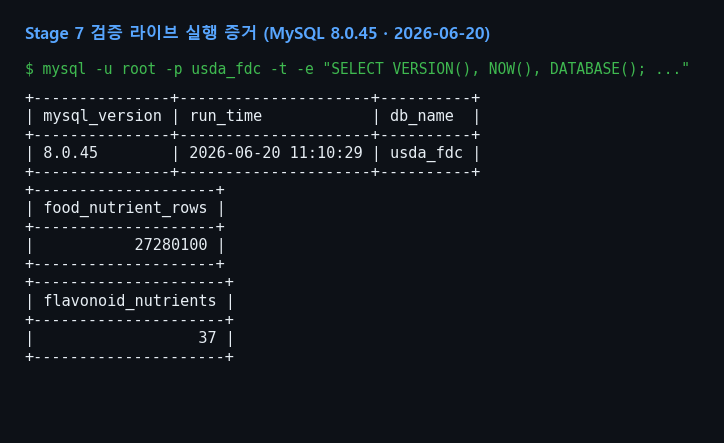

*캡처 0. 검증 라이브 실행 증거 — MySQL 8.0.45, 실행 시각 2026-06-20 11:10:29, DB `usda_fdc`. food_nutrient 27,280,100행·플라보노이드 37종이 현재 DB에 적재되어 있음을 확인.*

**① 테이블별 적재 행 수** — 합계 34,402,883

각 단계의 적재가 누락이나 중복 없이 끝났는지 모든 테이블의 행 수로 확인하는 항목이다. 10개 테이블을 합치면 34,402,883행이며, 특히 사실 테이블 food_nutrient는 원본 27,094,027행에 Stage 5 통합분 186,073행이 더해진 27,280,100행으로, 통합이 정확히 반영됐음을 행 수만으로도 확인할 수 있다.

| 테이블 | 행 수 | | 테이블 | 행 수 |
|---|---:|---|---|---:|
| food | 2,085,340 | | food_nutrient | 27,280,100 |
| nutrient | 514 | | tmp_flavdesc | 37 |
| survey_fndds_food | 5,432 | | tmp_mainfooddesc | 7,083 |
| sr_legacy_food | 7,793 | | tmp_flavval | 262,071 |
| branded_food | 1,993,975 | | unmatched_flavonoid | 75,998 |
| | | | **합계** | **34,402,883** |

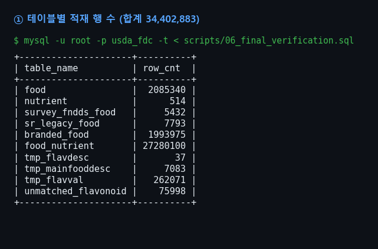

*캡처 1. 검증 ① 실제 실행 결과(mysql CLI). 10개 테이블 행 수 합계가 34,402,883과 일치한다.*

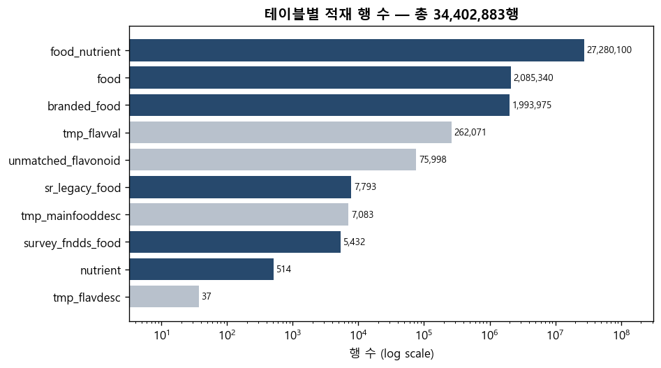

*그림 2. 테이블별 적재 행 수(로그 스케일). 사실 테이블 food_nutrient(27.28M)가 전체를 좌우하며, 임시·분리 테이블(회색)은 보조 규모다.*

**② Flavonoid 매핑 실패율**

플라보노이드 함량 데이터(tmp_flavval) 가운데 식별자 변환에 성공해 통합된 비율과 실패한 비율을 정량화하는 항목이다. 통합이 얼마나 온전하게 이뤄졌는지를 한 숫자로 보여주며, 실패분의 규모와 원인을 함께 짚는다.

- total 262,071 / matched 186,073 (71.00%) / unmatched 75,998 (29.00%)
- 사유: `No matching food_code in survey_fndds_food (version mismatch)` — 2017→2021 카테고리 재편으로 food_code 2,054개 폐기

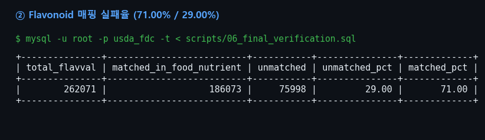

*캡처 2. 검증 ② 실제 실행 결과(mysql CLI). matched 186,073(71.00%) / unmatched 75,998(29.00%).*

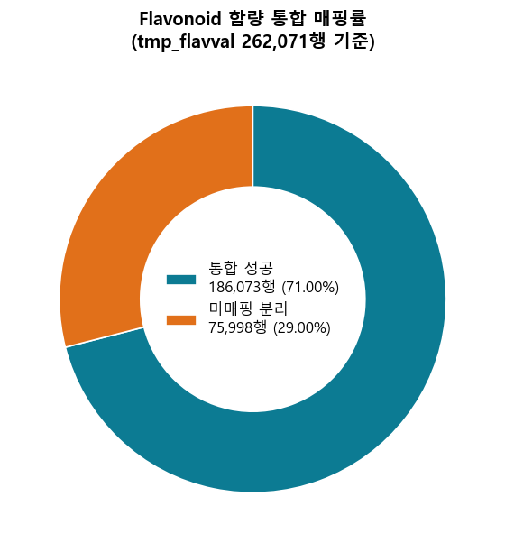

*그림 3. tmp_flavval 262,071행의 통합 매핑률. 71%는 식별자 무결성을 지킨 상태의 최대치이며, 미매핑 29%는 버전 시차로 인한 구조적 결과다(고찰 3-1).*

**③ Daidzein (nutrient_id=710) TOP 5**

통합된 플라보노이드 값이 영양학적으로 타당한지 실제 식품으로 점검(spot check)하는 항목이다. Daidzein은 콩에 풍부한 이소플라본 계열 성분이므로, 함량 상위 식품이 전부 콩 기반이라면 데이터가 올바른 식품에 올바르게 연결됐다는 방증이 된다.

| 순위 | fdc_id | 식품 | mg |
|:-:|:-:|---|---:|
| 1 | 2707451 | Textured vegetable protein, dry | 64.55 |
| 2 | 2707466 | Bacon bits | 64.37 |
| 3 | 2707433 | Soy nuts | 61.42 |
| 4 | 2710732 | Nutritional powder mix (EAS Soy Protein) | 30.07 |
| 5 | 2710743 | Nutritional powder mix, soy based, NFS | 30.07 |

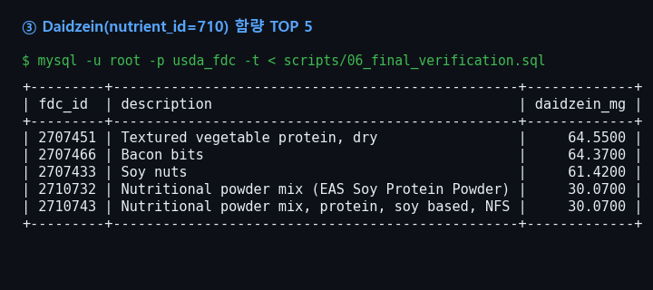

*캡처 3. 검증 ③ 실제 실행 결과(mysql CLI). Daidzein 함량 상위 5개 식품.*

- 상위 5개 전부 콩 기반 → Daidzein(이소플라본) 특성과 일치, 데이터 정확성 시각 확인

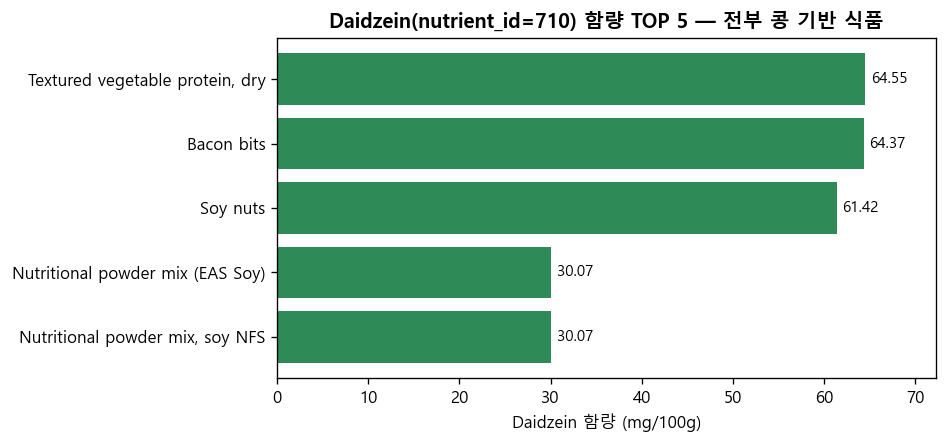

*그림 4. Daidzein 함량 상위 5개 식품. 모두 콩 기반으로, 이소플라본 계열인 Daidzein의 영양학적 특성과 일치한다.*

**④ Flavonoid 클래스별 평균 함량**

플라보노이드 7개 화학 클래스가 모두 통합됐는지, 그리고 클래스별 함량 분포가 합리적인지 확인하는 항목이다. 클래스마다 측정 행수와 평균·최소·최대 함량을 집계해, 어떤 계열이 자주 측정되고 어떤 계열이 함량이 높은지를 분리해 본다.

| class | 행수 | 평균(mg) | 최대(mg) |
|---|---:|---:|---:|
| (Total) | 5,029 | 5.5913 | 7,331.20 |
| Flavonols | 25,145 | 0.5132 | 697.85 |
| Flavan-3-ols | 65,377 | 0.4491 | 6,633.35 |
| Anthocyanidins | 35,203 | 0.3018 | 324.43 |
| Isoflavones | 20,116 | 0.2178 | 166.94 |
| Flavanones | 20,116 | 0.1194 | 101.45 |
| Flavones | 15,087 | 0.0945 | 216.55 |

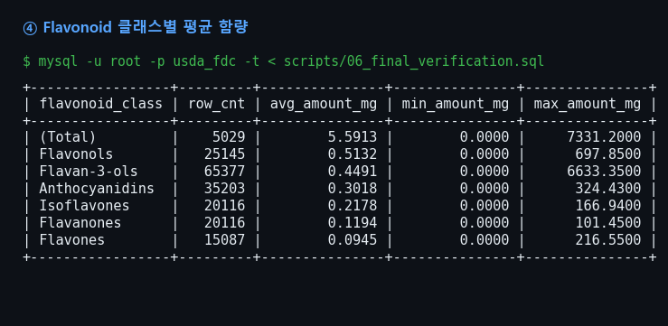

*캡처 4. 검증 ④ 실제 실행 결과(mysql CLI). 클래스별 행수·평균·최소·최대 함량.*

- 측정 빈도 최다 = Flavan-3-ols(65,377행), 평균 함량 최고 = Flavonols(0.5132mg) → 두 축은 별개

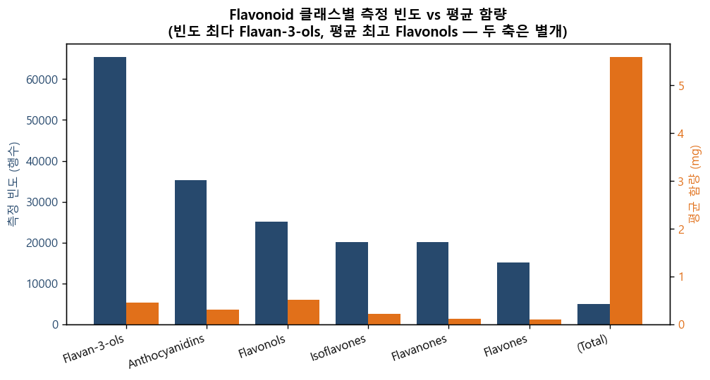

*그림 5. Flavonoid 클래스별 측정 빈도(파랑, 좌축)와 평균 함량(주황, 우축). 가장 많이 측정된 클래스와 평균 함량이 높은 클래스가 서로 달라, 측정 빈도와 함량이 별개의 축임을 보여준다.*

**⑤ 단일 식품 통합 조회** — fdc_id 2707451 (Textured vegetable protein, dry)

본 과제의 최종 목표 — "한 식품의 일반 영양소와 플라보노이드를 단일 SQL 한 번으로 함께 조회" — 가 실제로 동작하는지 확인하는 핵심 항목이다. 콩 단백 식품(fdc_id 2707451) 하나를 골라 `nutrient.is_flavonoid` 플래그로 일반 영양소와 플라보노이드를 구분해 함께 출력했다.

- 일반 영양소 65 + 플라보노이드 37 = **102행**을 단일 SQL로 통합 출력
- 일반: 칼륨 2,480mg / 인 726mg / Energy 366kcal / 단백질 51.1g
- 플라보노이드: Total isoflavones 166.94 = Genistein 87.31 + Daidzein 64.55 + Glycitein 15.08 (합산 정확 일치), 나머지 32종 0mg
- → 콩 식품의 자연스러운 영양 프로파일 재현 = 본 프로젝트 목적 달성 입증

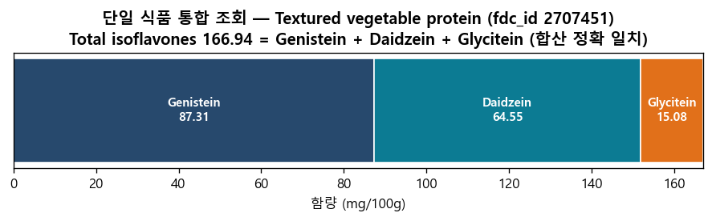

*그림 6. fdc_id 2707451의 Total isoflavones 166.94mg이 Genistein·Daidzein·Glycitein 세 성분의 합과 정확히 일치한다. 일반 영양소와 플라보노이드가 한 식품 아래 통합 조회됨을 보여주는 핵심 결과다.*

```sql
SELECT n.id, n.name, n.unit_name, fn.amount, n.is_flavonoid, n.flavonoid_class
FROM food_nutrient fn JOIN nutrient n ON fn.nutrient_id = n.id
WHERE fn.fdc_id = 2707451
ORDER BY n.is_flavonoid, fn.amount DESC;
```

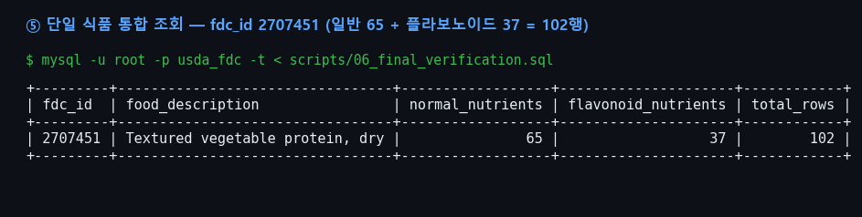

*캡처 5. 검증 ⑤ 실제 실행 결과(mysql CLI). fdc_id 2707451에 일반 65 + 플라보노이드 37 = 102행이 한 번에 조회된다.*

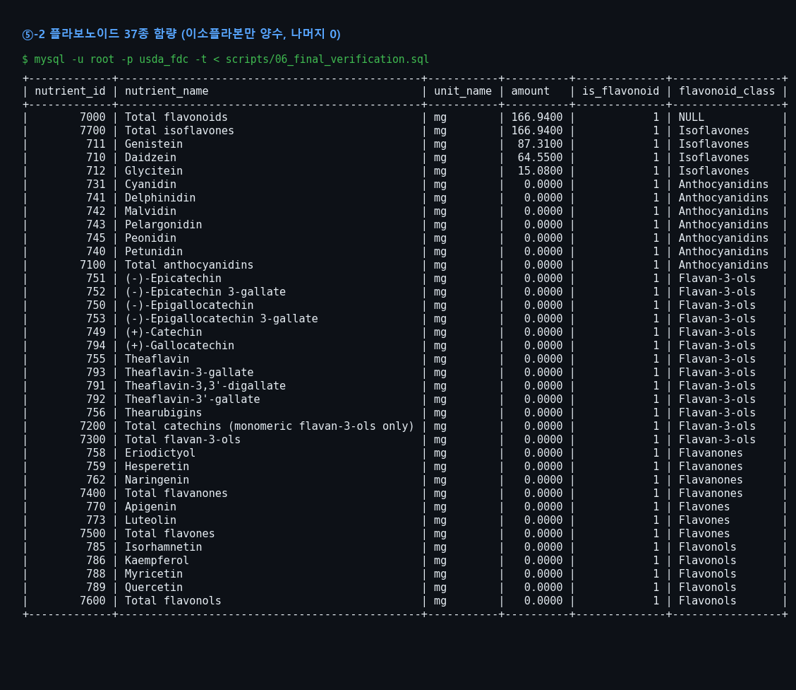

*캡처 6. 검증 ⑤ 상세(mysql CLI). 플라보노이드 37종 중 이소플라본 5종(Total flavonoids·Total isoflavones·Genistein·Daidzein·Glycitein)만 양수이고 나머지 32종은 0.0000 — 콩 식품의 영양 프로파일이 정확히 재현됨.*

---

# 3. 고찰

## 3-1. 매칭률 71%의 해석

매핑 실패 29%는 적재가 잘못되어 생긴 손실이 아니라 두 데이터셋의 버전 시차에서 비롯한 구조적 결과로 보아야 한다. Flavonoid 데이터의 식품 마스터(MAINFOODDESC)는 2017년 FNDDS를 기준으로 하는 반면 브릿지 `survey_fndds_food`는 2021년 기준인데, 2017년에서 2021년으로 넘어오며 USDA가 저나트륨·칼슘강화·산성유·환원분유 같은 마이너 변종 우유류 등을 대분류로 통합하거나 삭제하면서 food_code 2,054개가 사라졌다. 이 2,054개에 영양소 37종을 곱한 75,998행이 정확히 미매핑으로 남는다. 따라서 71%라는 수치는 데이터 무결성을 지킨 상태에서 도달할 수 있는 최대치이며, 이를 억지로 끌어올리려면 데이터를 왜곡할 수밖에 없다.

## 3-2. 분포 분석

- **food.data_type**: branded 95.6%(1,993,975) 압도적, 이하 sub_sample 3.1% / sr_legacy 0.4% / survey 0.3% 등 9종 → 통합 대상 survey는 0.3%에 불과하나 브릿지로서 결정적
- **flavonoid_class 빈도 vs 함량**: 측정 최다 Flavan-3-ols(65,377), 평균 최고 Flavonols(0.5132mg) → 빈도와 함량은 별개 축
- **결측 분포**: food_category_id NULL 14,554(주로 branded) / nutrient_nbr 12 / rank 11 / description 9 — 모두 임의값 미주입(NFR-06 준수)
- **단일 식품 프로파일**: 콩 식품(2707451)에서 isoflavone만 양수·나머지 0 → 영양학적으로 타당한 분포 재현

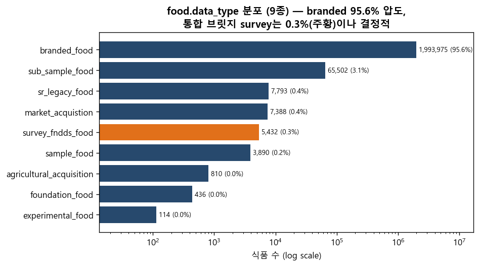

*그림 7. food.data_type 9종 분포(로그 스케일). branded_food가 95.6%로 압도적이고, 통합 브릿지가 되는 survey_fndds_food(주황)는 0.3%에 불과하나 두 데이터셋을 잇는 결정적 역할을 한다.*

## 3-3. 한계점

- 매칭률 71% 상한: 버전 시차로 인한 구조적 한계, 강제 회복 시 데이터 왜곡
- `sr_legacy_food` 보완 매핑 미수행: 명세 FR-20(선택) 미시도, description 정규화 매칭(2/2,054)만 검증
- LOAD DATA의 RFC4180 불완전성: quoted 필드 내 임베디드 newline/comma에서 silent skip → Python 보완 의존
- id 수동 부여 의존: `food_nutrient.id` AUTO_INCREMENT 부재로 ROW_NUMBER 오프셋 사용 → 동시 INSERT 시 경쟁 위험
- branded_food 적재 866s(2,302행/s): 대용량 정확-적재의 속도 한계
- 임시 테이블 잔존: `tmp_*` 3개가 운영 DB에 남음(분석 재현용), 정리 정책 부재
- 검증 표본 단일성: 통합 조회 검증이 fdc_id 1건(콩 식품)에 집중

## 3-4. 향후 과제

- `sr_legacy_food` / NDB_number 기반 2차 매핑 파이프라인 → 미매핑 일부 회복
- USDA 공식 2017↔2021 food_code 매핑 가이드 적용 → `unmatched_flavonoid`에서 1줄 SQL 재통합
- `food_nutrient.id` AUTO_INCREMENT 전환 → ROW_NUMBER 의존 제거
- 적재 후 자동 무결성 진단 스크립트(행수 diff + 임베디드 newline 탐지) 상시화
- `tmp_*` 정리/아카이브 정책 수립(적재 완료 후 분리 스키마 이동)
- 다중 식품 통합 조회 대시보드(클래스별 대표 식품 N건)로 검증 표본 확대
- 증분 적재(Incremental load) 지원 → USDA 신규 릴리스 시 델타만 반영

---

# 부록 A — 설계 결정

본 부록은 프로젝트 진행 중 분기점이 있었던 설계 결정과 그 근거를 기록한다.

## A-1. 식별자 불일치 해소 — 브릿지 JOIN

**문제**: FDC의 `fdc_id`와 Flavonoid 데이터의 8자리 `food_code`는 식별 체계가 달라 직접 JOIN이 불가능하다. 통합의 핵심 난제.

**대안**:
- A: `description` 텍스트 매칭으로 두 데이터셋을 연결
- B: `survey_fndds_food`(FNDDS food_code ↔ fdc_id)를 브릿지로 두고 식별자 기반 JOIN

**선택**: B

**근거**: 식별자 기반 변환은 정확하고 결정적이다. 반면 텍스트 매칭은 회복분석 결과 2/2,054(0.097%)만 성공 → 신뢰할 수 없다.

## A-2. food_category_id 타입

**문제**: `food_category_id`에 숫자(`"1002"`)와 문자(`"Oils Edible"`)가 혼재.

**대안**: INT / VARCHAR

**선택**: VARCHAR(80)

**근거**: 문자값이 실재하므로 정수형으로 받을 수 없다.

## A-3. food_code 정수 폭

**문제**: `food_code` 최대값 99,998,210을 담을 정수 타입 선택.

**대안**: INT UNSIGNED / BIGINT

**선택**: INT UNSIGNED

**근거**: 최대값이 약 42억(INT UNSIGNED 상한) 미만 → INT로 충분. BIGINT는 저장 공간 낭비.

## A-4. nutrient 통합 컬럼 추가 시점

**문제**: `is_flavonoid`·`flavonoid_class` 컬럼을 언제 추가할지.

**대안**: Stage 4에서 ALTER / Stage 1 DDL에 선반영

**선택**: 선반영

**근거**: DDL에 미리 넣어두면 Stage 4 통합을 ALTER 없이 INSERT만으로 처리할 수 있다. 대용량 테이블 ALTER 패턴을 피하는 습관도 겸함.

## A-5. 명세 외 percent_daily_value

**문제**: 과제 명세에는 없는 `percent_daily_value` 컬럼이 실제 CSV에는 존재.

**대안**: 무시 / DDL에 포함

**선택**: 포함

**근거**: 데이터 손실 방지(NFR-06). 명세보다 실데이터를 우선.

## A-6. food_nutrient.id PK 충돌

**문제**: `food_nutrient.id`에 AUTO_INCREMENT가 없어 `INSERT...SELECT` 시 id가 0 기본값으로 들어가 PK 충돌(부록 B T-7).

**대안**: DDL을 ALTER하여 AUTO_INCREMENT 부여 / INSERT 시 `ROW_NUMBER`로 수동 부여

**선택**: ROW_NUMBER 수동 부여

**근거**: Stage 1 산출물(DDL)을 불변으로 유지하고 INSERT만 수정하는 쪽이 영향 범위가 작다. `@offset + ROW_NUMBER() OVER ()` 사용.

## A-7. 매핑 실패분 처리

**문제**: food_code 변환에 실패한 75,998행을 어떻게 둘 것인가.

**대안**: 본 테이블(food_nutrient)에 강제 귀속 / 별도 테이블로 분리

**선택**: `unmatched_flavonoid`로 분리

**근거**: 실패분을 본 테이블에 섞으면 영양학적 분석이 왜곡된다. 분리하면 무결성 보존 + 실패 사유 추적이 가능(NFR-04).

## A-8. 소용량 테이블 적재 방법

**문제**: nutrient/survey/sr_legacy 적재 시 `LOAD DATA`가 quoted-comma 필드에서 일부 행을 누락.

**대안**: LOAD DATA / Python(csv + executemany)

**선택**: Python

**근거**: 소용량이라 LOAD의 속도 이점이 무의미 → 정확성을 우선.

## A-9. unmatched 안티조인 패턴

**문제**: 미매칭 행을 추출하는 쿼리 패턴 선택.

**대안**: `LEFT JOIN ... IS NULL` / `NOT EXISTS`

**선택**: NOT EXISTS

**근거**: 결과는 동일(75,998)하나 "매칭 실패분 추출"이라는 의도가 더 명확히 드러난다.

## A-10. FK 삭제/갱신 정책

**문제**: 외래키의 `ON DELETE`/`ON UPDATE` 동작 선택.

**대안**: RESTRICT / CASCADE

**선택**: CASCADE

**근거**: food를 중심으로 한 자식 테이블 일관성을 자동 유지.

---

# 부록 B — 트러블슈팅

본 부록은 진행 중 발생한 문제와 해결 과정을 단계 순으로 기록한다.

## T-1. LOAD DATA LOCAL 거부 (Stage 2)

**현상**: `LOAD DATA LOCAL INFILE` 실행 시 서버가 거부.

**원인**: MySQL 8.0의 `local_infile`이 기본 OFF 정책.

**조치**: 서버에서 `SET GLOBAL local_infile=1`, 클라이언트에 `--local-infile=1` 부여.

## T-2. TRUNCATE 거부 — ERROR 1701 (Stage 2)

**현상**: 자식 테이블이 비어 있어도 `TRUNCATE`가 ERROR 1701로 거부됨.

**원인**: MySQL 8.0은 FK로 참조되는 테이블의 TRUNCATE를 무조건 차단.

**조치**: `DELETE FROM`으로 우회(재적재 멱등성 확보).

## T-3. `mysql -e` LOAD 0행 적재 (Stage 2)

**현상**: `mysql -e "LOAD DATA ..."` 형태가 0행을 적재.

**원인**: 셸과 클라이언트의 2단계 quote 처리가 충돌하여 경로/구문이 깨짐.

**조치**: SQL을 파일로 분리하고 `mysql < file.sql` 리다이렉트로 실행.

## T-4. `rows` 별칭 syntax error (Stage 2)

**현상**: 검증 쿼리에서 `AS rows` 사용 시 syntax error.

**원인**: `rows`도 MySQL 예약어.

**조치**: 별칭을 `row_cnt`로 변경.

## T-5. food LOAD 41,801행 silent skip (Stage 2)

**현상**: food.csv가 2,085,340행인데 LOAD 후 2,043,540행만 적재(41,801행 조용히 누락).

**원인**: `description` 내부에 임베디드 `\n`이 있어 LOAD가 이를 행 경계로 오인.

**조치**: Python `csv.reader`(RFC4180 표준 파서)로 누락 `fdc_id`를 검출해 보완 INSERT.

```python
# food_topup.py — LOAD가 누락한 fdc_id를 csv.reader로 검출해 보완 INSERT
import csv
loaded = set(...)  # DB에 적재된 fdc_id
with open('food.csv', newline='', encoding='utf-8') as fp:
    for row in csv.reader(fp):          # RFC4180 표준 파서 → 임베디드 newline 안전
        if row[0] not in loaded:
            cur.execute("INSERT INTO food (...) VALUES (...)", row)
# 부작용: fdc_id=0 1행 혼입 → DELETE FROM food WHERE fdc_id=0;
```

## T-6. 소용량 LOAD 부분 누락 (Stage 2)

**현상**: nutrient/survey/sr_legacy 등 소용량 테이블 LOAD에서도 일부 행 누락.

**원인**: `"Carbohydrate, by difference"`처럼 quoted-comma 필드를 LOAD가 제대로 처리 못함(RFC4180 한계).

**조치**: 소용량 3개를 Python(csv + executemany)으로 전환(설계 결정 A-8).

## T-7. INSERT...SELECT 시 Duplicate entry '0' (Stage 5)

**현상**: 통합 INSERT 실행 시 `Duplicate entry '0' for key 'PRIMARY'`.

**원인**: `food_nutrient.id`에 AUTO_INCREMENT가 없어 id가 0 기본값으로 들어감. (Stage 2 LOAD는 CSV의 id를 그대로 받아 문제가 드러나지 않았음.)

**조치**: `@offset = MAX(id)` 기반으로 `ROW_NUMBER`를 더해 id를 수동 부여(설계 결정 A-6).

```
SHOW CREATE TABLE food_nutrient;
-- `id` bigint unsigned NOT NULL,  PRIMARY KEY (`id`)   ← AUTO_INCREMENT 없음
-- Stage 2 LOAD는 CSV의 id를 그대로 받아 동작했으나, INSERT...SELECT는 id 미지정 → 0 충돌
```

## T-8. FLAVDESC 행수 명세(38)와 차이 (Stage 3)

**현상**: 명세는 FLAVDESC를 38종으로 표기했으나 실제 적재 행은 37.

**원인**: 명세의 "38"은 헤더 포함 raw row 수(max_row=38). 실데이터는 37행.

**조치**: 실데이터 37행이 정확함을 확인하고 표기 차이로 종결(데이터 손실 아님).

---

# 부록 C — 스키마 전문 (DDL)

> 아래는 2026-06-19에 운영 중인 `usda_fdc` DB에서 실제 추출한 DDL이다(인덱스·FK·코멘트 포함). 원본 덤프: [scripts/_run/_live_ddl.txt](../scripts/_run/_live_ddl.txt)

```sql
-- ① food : 모든 식품의 루트
CREATE TABLE `food` (
  `fdc_id` int unsigned NOT NULL COMMENT 'FDC global food identifier (PK)',
  `data_type` varchar(40) NOT NULL COMMENT 'Food type (9 types)',
  `description` varchar(500) DEFAULT NULL COMMENT 'Food name (max 271 chars)',
  `food_category_id` varchar(80) DEFAULT NULL COMMENT 'Category string',
  `publication_date` date NOT NULL,
  PRIMARY KEY (`fdc_id`),
  KEY `idx_food_data_type` (`data_type`),
  KEY `idx_food_description` (`description`(100))
) ENGINE=InnoDB DEFAULT CHARSET=utf8mb4 COLLATE=utf8mb4_unicode_ci;

-- ② nutrient : 영양소 사전 (477 일반 + 37 플라보노이드)
CREATE TABLE `nutrient` (
  `id` int unsigned NOT NULL COMMENT 'Nutrient ID (flavonoids 710-7700)',
  `name` varchar(255) NOT NULL,
  `unit_name` varchar(20) NOT NULL,
  `nutrient_nbr` decimal(6,1) DEFAULT NULL COMMENT 'INFOODS code (NULL 12)',
  `rank` decimal(8,2) DEFAULT NULL COMMENT 'Display order (NULL 11)',
  `is_flavonoid` tinyint(1) NOT NULL DEFAULT '0',
  `flavonoid_class` varchar(50) DEFAULT NULL,
  PRIMARY KEY (`id`),
  KEY `idx_nutrient_is_flavonoid` (`is_flavonoid`),
  KEY `idx_nutrient_flavonoid_class` (`flavonoid_class`)
) ENGINE=InnoDB DEFAULT CHARSET=utf8mb4 COLLATE=utf8mb4_unicode_ci;

-- ③ survey_fndds_food : 브릿지 (fdc_id ↔ food_code)
CREATE TABLE `survey_fndds_food` (
  `fdc_id` int unsigned NOT NULL COMMENT 'PK, FK -> food.fdc_id',
  `food_code` int unsigned NOT NULL COMMENT 'FNDDS 8-digit (max 99,998,210)',
  `wweia_category_code` smallint unsigned NOT NULL,
  `start_date` date NOT NULL,
  `end_date` date NOT NULL,
  PRIMARY KEY (`fdc_id`),
  KEY `idx_survey_food_code` (`food_code`),
  CONSTRAINT `fk_survey_fdc` FOREIGN KEY (`fdc_id`) REFERENCES `food` (`fdc_id`)
    ON DELETE CASCADE ON UPDATE CASCADE
) ENGINE=InnoDB DEFAULT CHARSET=utf8mb4 COLLATE=utf8mb4_unicode_ci;

-- ④ sr_legacy_food : 보조 매핑 (fdc_id ↔ NDB_number)
CREATE TABLE `sr_legacy_food` (
  `fdc_id` int unsigned NOT NULL COMMENT 'PK, FK -> food.fdc_id',
  `NDB_number` int unsigned NOT NULL COMMENT 'Legacy SR code (max 93,600)',
  PRIMARY KEY (`fdc_id`),
  KEY `idx_sr_ndb_number` (`NDB_number`),
  CONSTRAINT `fk_sr_legacy_fdc` FOREIGN KEY (`fdc_id`) REFERENCES `food` (`fdc_id`)
    ON DELETE CASCADE ON UPDATE CASCADE
) ENGINE=InnoDB DEFAULT CHARSET=utf8mb4 COLLATE=utf8mb4_unicode_ci;

-- ⑤ branded_food : 가공식품 라벨 (21컬럼, ingredients TEXT)
CREATE TABLE `branded_food` (
  `fdc_id` int unsigned NOT NULL COMMENT 'PK, FK -> food.fdc_id',
  `brand_owner` varchar(255) DEFAULT NULL,
  `brand_name` varchar(255) DEFAULT NULL,
  `subbrand_name` varchar(255) DEFAULT NULL,
  `gtin_upc` varchar(20) DEFAULT NULL,
  `ingredients` text COMMENT 'long text - TEXT required',
  `not_a_significant_source_of` varchar(255) DEFAULT NULL,
  `serving_size` decimal(8,2) DEFAULT NULL,
  `serving_size_unit` varchar(10) DEFAULT NULL,
  `household_serving_fulltext` varchar(255) DEFAULT NULL,
  `branded_food_category` varchar(100) DEFAULT NULL,
  `data_source` varchar(10) DEFAULT NULL,
  `package_weight` varchar(50) DEFAULT NULL,
  `modified_date` date DEFAULT NULL,
  `available_date` date DEFAULT NULL,
  `market_country` varchar(50) DEFAULT NULL,
  `discontinued_date` date DEFAULT NULL,
  `preparation_state_code` varchar(30) DEFAULT NULL,
  `trade_channel` varchar(50) DEFAULT NULL,
  `short_description` varchar(255) DEFAULT NULL,
  `material_code` varchar(50) DEFAULT NULL,
  PRIMARY KEY (`fdc_id`),
  KEY `idx_branded_brand_owner` (`brand_owner`(100)),
  KEY `idx_branded_category` (`branded_food_category`),
  KEY `idx_branded_gtin` (`gtin_upc`),
  CONSTRAINT `fk_branded_fdc` FOREIGN KEY (`fdc_id`) REFERENCES `food` (`fdc_id`)
    ON DELETE CASCADE ON UPDATE CASCADE
) ENGINE=InnoDB DEFAULT CHARSET=utf8mb4 COLLATE=utf8mb4_unicode_ci;

-- ⑥ food_nutrient : 사실 테이블 (27.28M행)
CREATE TABLE `food_nutrient` (
  `id` bigint unsigned NOT NULL COMMENT 'Row ID (PK)',
  `fdc_id` int unsigned NOT NULL COMMENT 'FK -> food.fdc_id',
  `nutrient_id` int unsigned NOT NULL COMMENT 'FK -> nutrient.id',
  `amount` decimal(14,4) DEFAULT NULL COMMENT 'per 100g',
  `data_points` int DEFAULT NULL,
  `derivation_id` int DEFAULT NULL,
  `min` decimal(14,4) DEFAULT NULL,
  `max` decimal(14,4) DEFAULT NULL,
  `median` decimal(14,4) DEFAULT NULL,
  `loq` decimal(14,4) DEFAULT NULL,
  `footnote` varchar(255) DEFAULT NULL,
  `min_year_acquired` int DEFAULT NULL,
  `percent_daily_value` decimal(6,2) DEFAULT NULL COMMENT 'not in spec but present',
  PRIMARY KEY (`id`),
  KEY `idx_fn_fdc_id` (`fdc_id`),
  KEY `idx_fn_nutrient_id` (`nutrient_id`),
  KEY `idx_fn_fdc_nutrient` (`fdc_id`,`nutrient_id`),
  CONSTRAINT `fk_fn_fdc` FOREIGN KEY (`fdc_id`) REFERENCES `food` (`fdc_id`)
    ON DELETE CASCADE ON UPDATE CASCADE,
  CONSTRAINT `fk_fn_nutrient` FOREIGN KEY (`nutrient_id`) REFERENCES `nutrient` (`id`)
    ON DELETE CASCADE ON UPDATE CASCADE
) ENGINE=InnoDB DEFAULT CHARSET=utf8mb4 COLLATE=utf8mb4_unicode_ci;

-- ⑦~⑨ 임시 테이블
CREATE TABLE `tmp_flavdesc` (
  `nutrient_code` int unsigned NOT NULL,
  `flavonoid_description` varchar(100) DEFAULT NULL,
  `flavonoid_class` varchar(50) DEFAULT NULL,
  `tagname` varchar(20) DEFAULT NULL,
  `unit` varchar(10) DEFAULT NULL,
  `decimals` int DEFAULT NULL,
  PRIMARY KEY (`nutrient_code`)
) ENGINE=InnoDB DEFAULT CHARSET=utf8mb4 COLLATE=utf8mb4_unicode_ci;

CREATE TABLE `tmp_mainfooddesc` (
  `food_code` int unsigned NOT NULL,
  `start_date` date DEFAULT NULL,
  `end_date` date DEFAULT NULL,
  `main_food_description` varchar(500) DEFAULT NULL,
  PRIMARY KEY (`food_code`)
) ENGINE=InnoDB DEFAULT CHARSET=utf8mb4 COLLATE=utf8mb4_unicode_ci;

CREATE TABLE `tmp_flavval` (
  `id` int unsigned NOT NULL AUTO_INCREMENT,
  `food_code` int unsigned NOT NULL,
  `nutrient_code` int unsigned NOT NULL,
  `start_date` date DEFAULT NULL,
  `end_date` date DEFAULT NULL,
  `nutrient_value` decimal(10,4) DEFAULT NULL,
  PRIMARY KEY (`id`),
  KEY `idx_tmp_food_code` (`food_code`),
  KEY `idx_tmp_nutrient_code` (`nutrient_code`)
) ENGINE=InnoDB DEFAULT CHARSET=utf8mb4 COLLATE=utf8mb4_unicode_ci;

-- ⑩ unmatched_flavonoid : 분리 보존 (독립, FK 없음)
CREATE TABLE `unmatched_flavonoid` (
  `id` int unsigned NOT NULL AUTO_INCREMENT,
  `food_code` int unsigned NOT NULL,
  `nutrient_code` int unsigned NOT NULL,
  `start_date` date DEFAULT NULL,
  `end_date` date DEFAULT NULL,
  `nutrient_value` decimal(10,4) DEFAULT NULL,
  `unmatch_reason` varchar(100) DEFAULT NULL,
  PRIMARY KEY (`id`),
  KEY `idx_unmatched_food_code` (`food_code`),
  KEY `idx_unmatched_reason` (`unmatch_reason`)
) ENGINE=InnoDB DEFAULT CHARSET=utf8mb4 COLLATE=utf8mb4_unicode_ci;
```

**인덱스 정당화**

- `idx_survey_food_code` (survey_fndds_food): Stage 5 JOIN `ON f.food_code=s.food_code` 가속 — 통합 핵심 경로
- `idx_fn_fdc_nutrient` (food_nutrient, 복합): 검증 ⑤ 단일식품 조회 + (fdc_id,nutrient_id) 중복 검사
- `idx_nutrient_is_flavonoid` (nutrient): 검증 ④·⑤ 플라보노이드 필터
- `idx_tmp_food_code` (tmp_flavval): Stage 5·6 안티조인 가속
- `idx_food_data_type` (food): data_type 분포 검증

---

# 부록 D — 다이어그램

## D-1. ER 다이어그램

```mermaid
erDiagram
    food ||--o| survey_fndds_food : "1:1 (fdc_id)"
    food ||--o| sr_legacy_food : "1:1 (fdc_id)"
    food ||--o| branded_food : "1:1 (fdc_id)"
    food ||--o{ food_nutrient : "1:N (fdc_id)"
    nutrient ||--o{ food_nutrient : "1:N (nutrient_id)"

    food {
        int_unsigned fdc_id PK
        varchar data_type
        varchar description
        varchar food_category_id
        date publication_date
    }
    nutrient {
        int_unsigned id PK
        varchar name
        varchar unit_name
        tinyint is_flavonoid
        varchar flavonoid_class
    }
    survey_fndds_food {
        int_unsigned fdc_id PK_FK
        int_unsigned food_code
        smallint wweia_category_code
    }
    sr_legacy_food {
        int_unsigned fdc_id PK_FK
        int_unsigned NDB_number
    }
    branded_food {
        int_unsigned fdc_id PK_FK
        text ingredients
        varchar brand_owner
    }
    food_nutrient {
        bigint_unsigned id PK
        int_unsigned fdc_id FK
        int_unsigned nutrient_id FK
        decimal amount
    }
    unmatched_flavonoid {
        int_unsigned id PK
        int_unsigned food_code
        int_unsigned nutrient_code
        varchar unmatch_reason
    }
```

## D-2. 통합 시퀀스 (식별자 변환 흐름)

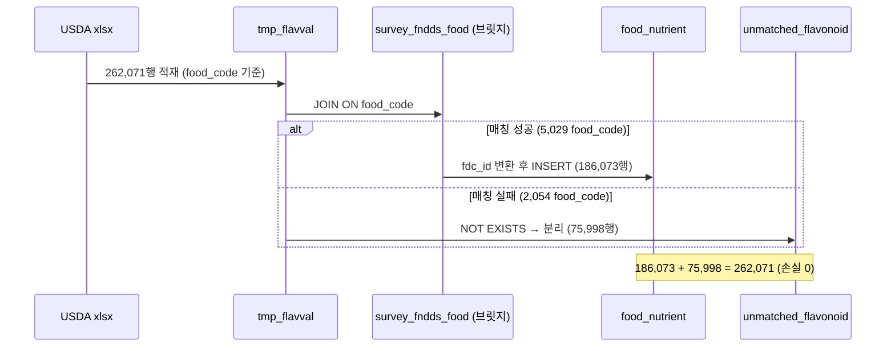

## D-3. 컴포넌트(파이프라인) 구성

```mermaid
flowchart LR
    subgraph SRC[원본]
        C1[CSV 6종]
        X1[xlsx 3시트]
    end
    subgraph LOAD[적재 계층]
        L1[LOAD DATA INFILE]
        P1[Python csv/pandas]
    end
    subgraph DB[(usda_fdc MySQL)]
        F[food/nutrient/...]
        TMP[tmp_*]
        FN[food_nutrient]
        UM[unmatched_flavonoid]
    end
    C1 --> L1 --> F
    C1 --> P1 --> F
    X1 --> P1 --> TMP
    TMP -->|JOIN survey| FN
    TMP -->|NOT EXISTS| UM
    FN --> V[검증 5항목]
```

---

# 부록 E — 실행 가이드

## E-1. 환경

- MySQL 8.0.45 / InnoDB / utf8mb4 · utf8mb4_unicode_ci / DB명 `usda_fdc`
- Python 3.x + `pandas`, `mysql-connector-python`, `openpyxl` (`requirements.txt`)
- 원본 CSV 6 + xlsx 1 (루트), `local_infile=ON`

## E-2. 실행 순서 (부모→자식)

```bash
# 0) DB/DDL
mysql -u root -p < usda_fdc_flavonoid_ddl.sql        # (설계문서 첨부 DDL)

# 1) 대용량 LOAD (food, food_nutrient)
mysql -u root -p --local-infile=1 usda_fdc < scripts/01_load_large_tables.sql
python scripts/_run/food_topup.py --user root --password <pw>   # food 누락 보완

# 2) 소용량 Python 적재
python scripts/_run/load_small_python.py --user root --password <pw>

# 3) branded_food (pandas chunked, ~866s)
python scripts/03_load_branded_food.py --host localhost --user root --password <pw>

# 4) xlsx → tmp_* 적재
python scripts/05_extract_and_load_xlsx.py --user root --password <pw>

# 5) nutrient 확장 / 통합 INSERT / unmatched 분리
mysql -u root -p usda_fdc < scripts/_run/stage4_nutrient_expand.sql
mysql -u root -p usda_fdc < scripts/_run/stage5_insert.sql
mysql -u root -p usda_fdc < scripts/_run/stage6_insert.sql

# 6) 최종 검증
mysql -u root -p usda_fdc < scripts/06_final_verification.sql
```

## E-3. 예상 소요 시간

- food LOAD + 보완: ~28s
- food_nutrient LOAD: ~410s
- branded_food: ~866s
- xlsx → tmp_*: ~9s
- 통합 INSERT (Stage 5): ~7s
- unmatched 분리: ~0.7s
- **합계(대략): ~22분**

## E-4. 재시작 안전성

- 각 LOAD 앞 `DELETE FROM`(TRUNCATE 대체) → 멱등 적재
- Stage 4·5·6은 단일 `INSERT ... SELECT` 트랜잭션 → 실패 시 롤백 후 재실행 안전
- Stage 5 재실행: `@offset = MAX(id)` 기반이라 id 충돌 없음, 단 직전 186,073행 선삭제 필요(중복 방지)
- FK 검증: 적재 후 `foreign_key_checks=1` 복원 상태에서 LEFT JOIN 재확인

---

# 부록 F — 요구사항 · 채점 기준 대응표

## F-1. 채점 기준 (100점) 대응

| 채점 항목 | 배점 | 충족 | 근거 위치 |
|---|:-:|:-:|---|
| **DDL** (6테이블 PK/FK/INDEX + 정당화) | 20 | ✓ | 부록 C (라이브 DDL) · Ch.1 · 부록 A |
| **적재** (순서·대용량옵션·행수) | 20 | ✓ | Ch.2 성능비교표 · 부록 B(T-1~T-6) |
| **ERD** (전체 테이블) | 10 | △ | 부록 D-1 Mermaid (제출 시 피터첸 캡처 권장) |
| **nutrient 확장** (충돌검증 + INSERT) | 10 | ✓ | Ch.4 (충돌 0 + 37행) |
| **food_nutrient 확장** (식별자 변환) | 20 | ✓ | Ch.5 (survey 경유 186,073행) |
| **unmatched 처리** | 10 | ✓ | Ch.6 (75,998행 + 사유) |
| **검증 + 보고서** (5항목 + 가독성) | 10 | ✓ | Ch.7 · 본 문서 전체 |
| **합계** | **100** | | |

> △(ERD): 본 문서엔 Mermaid ER이 포함되어 있으나, 명세 FR-26은 **피터첸 표기법**을 요구한다. 제출 PDF에는 설계문서의 피터첸 ERD 이미지를 함께 삽입할 것.

## F-2. 기능 요구사항(FR) 대응

| FR | 내용 | 충족 | 위치 |
|---|---|:-:|---|
| FR-01~08 | DDL 6테이블 PK/FK/INDEX 정당화 | ✓ | 부록 C · A |
| FR-09~11 | CSV 부모→자식 순, 대용량 옵션, 행수 | ✓ | Ch.2 |
| FR-12~13 | xlsx → tmp_* 적재 | ✓ | Ch.3 |
| FR-14~16 | nutrient 확장 + 충돌검증 + 37행 INSERT | ✓ | Ch.4 |
| FR-17 | food_code → fdc_id 변환 186,073 INSERT | ✓ | Ch.5 |
| FR-18~19 | unmatched 75,998 분리 + 사유 분류 | ✓ | Ch.6 |
| FR-20 | sr_legacy_food 보완 매핑 (**선택**) | ✗ | 미수행 — 고찰 3-3, 향후 3-4 |
| FR-21~25 | 검증 5항목 | ✓ | Ch.7 |
| FR-26 | 전체 테이블 ERD (피터첸) | △ | 부록 D-1 + docx 캡처 |

## F-3. 비기능 요구사항(NFR) 대응

| NFR | 내용 | 충족 | 근거 |
|---|---|:-:|---|
| NFR-01 | utf8mb4 / utf8mb4_unicode_ci | ✓ | 부록 C 전 테이블 |
| NFR-02 | FK 부모 PK 참조 + 적재 순서 무결성 | ✓ | FK 5개 / 고아 0 |
| NFR-03 | 대용량 LOAD DATA INFILE | ✓ | Ch.2 |
| NFR-04 | 매핑 실패 분리 (unmatched) | ✓ | Ch.6 |
| NFR-05 | 결과 표/캡처 + 단계별 행수 | ✓ | Ch.7 · 1 |
| NFR-06 | 결측 NULL 허용, 임의값 미주입 | ✓ | 고찰 3-2 / 부록 C |

---

# 부록 G — 코드 · 스크립트

본 부록은 **채점 기준(100점) 각 항목에 해당하는 코드**를 모은 것이다. 어떤 코드가 어느 배점 항목을 충족하는지 아래 표로 먼저 정리한다. 전체 원본 파일은 저장소 `scripts/` 폴더에 있으며, 비밀번호 등 민감 정보는 마스킹(`********`)했다.

| 채점 항목 | 배점 | 코드 위치 |
|---|:-:|---|
| **DDL** (6테이블 PK/FK/INDEX + 정당화) | 20 | [부록 C](#부록-c--스키마-전문-ddl) `CREATE TABLE` 전문 |
| **적재** (순서·대용량 옵션·행수) | 20 | G-1 LOAD DATA · G-2 소용량 Python · G-3 branded pandas |
| **ERD** (전체 테이블) | 10 | [부록 D](#부록-d--다이어그램) (다이어그램, 코드 아님) |
| **nutrient 확장** (충돌검증 + INSERT) | 10 | G-5 |
| **food_nutrient 확장** (식별자 변환 INSERT) | 20 | G-6 |
| **unmatched 처리** | 10 | G-7 |
| **검증 + 보고서** (5항목) | 10 | G-8 |

> Stage 3(xlsx → tmp_*)은 채점 기준에 별도 배점은 없으나 nutrient·food_nutrient 확장의 입력이 되므로 G-4에 함께 싣는다. DDL 코드는 분량상 [부록 C](#부록-c--스키마-전문-ddl)에 두고 여기서는 중복하지 않는다.

## G-1. 적재 (20점) — 대용량 LOAD DATA (`scripts/01_load_large_tables.sql`)

대용량 `food`·`food_nutrient`는 속도를 위해 `LOAD DATA LOCAL INFILE`로 적재했다. 적재 전 세션 옵션으로 검사 비용을 낮추고, 빈 문자열을 `NULLIF`로 NULL 처리한다.

```sql
USE usda_fdc;
SET SESSION sql_mode = '';            -- 빈 문자열을 NULL로 처리(STRICT 해제)
SET SESSION unique_checks = 0;        -- 적재 중 유니크 검사 끔
SET SESSION foreign_key_checks = 0;   -- 적재 중 FK 검사 끔(적재 후 재검증)
SET SESSION autocommit = 0;
SET GLOBAL  local_infile = 1;         -- LOCAL INFILE 허용

-- food.csv
LOAD DATA LOCAL INFILE 'data/raw/food.csv'
INTO TABLE food
CHARACTER SET utf8mb4
FIELDS TERMINATED BY ',' OPTIONALLY ENCLOSED BY '"' ESCAPED BY '"'
LINES TERMINATED BY '\n'
IGNORE 1 LINES
(fdc_id, data_type, @description, @food_category_id, @publication_date)
SET
  description      = NULLIF(@description, ''),
  food_category_id = NULLIF(@food_category_id, ''),
  publication_date = NULLIF(@publication_date, '');
COMMIT;

-- food_nutrient.csv (★ 부모 테이블 적재 후 최후 실행, 예약어는 백틱)
LOAD DATA LOCAL INFILE 'data/raw/food_nutrient.csv'
INTO TABLE food_nutrient
CHARACTER SET utf8mb4
FIELDS TERMINATED BY ',' OPTIONALLY ENCLOSED BY '"' ESCAPED BY '"'
LINES TERMINATED BY '\n'
IGNORE 1 LINES
( id, fdc_id, nutrient_id, amount, @data_points, @derivation_id,
  @min_val, @max_val, @median_val, @loq, @footnote, @min_year_acquired, @pct_dv )
SET
  data_points         = NULLIF(@data_points, ''),
  derivation_id       = NULLIF(@derivation_id, ''),
  `min`               = NULLIF(@min_val, ''),
  `max`               = NULLIF(@max_val, ''),
  median              = NULLIF(@median_val, ''),
  loq                 = NULLIF(@loq, ''),
  footnote            = NULLIF(@footnote, ''),
  min_year_acquired   = NULLIF(@min_year_acquired, ''),
  percent_daily_value = NULLIF(@pct_dv, '');
COMMIT;

-- 세션 원복
SET SESSION foreign_key_checks = 1;
SET SESSION unique_checks      = 1;
SET SESSION autocommit         = 1;
```

## G-2. 적재 (20점) — 소용량 Python 적재 (`scripts/_run/load_small_python.py`)

`nutrient`·`survey_fndds_food`·`sr_legacy_food`는 LOAD가 quoted-comma에서 일부 행을 누락해, csv 표준 파서 + `executemany`로 적재했다(빈 문자열은 None으로 변환).

```python
import csv, time
import mysql.connector

cnx = mysql.connector.connect(
    host="localhost", port=3306, user="root", password="********",
    database="usda_fdc", charset="utf8mb4", autocommit=False, use_pure=True,
)
cur = cnx.cursor()
cur.execute("SET SESSION sql_mode=''")
cur.execute("SET SESSION foreign_key_checks=0")
cur.execute("SET SESSION unique_checks=0")

def load(table, csv_path, cols):
    cur.execute(f"DELETE FROM `{table}`")
    sql = f"INSERT INTO `{table}` ({', '.join('`'+c+'`' for c in cols)}) " \
          f"VALUES ({', '.join(['%s']*len(cols))})"
    rows = []
    with open(csv_path, encoding="utf-8", newline="") as f:
        r = csv.reader(f); header = next(r)
        idx = [header.index(c) for c in cols]
        for row in r:
            rows.append(tuple(None if row[i] == "" else row[i] for i in idx))
    cur.executemany(sql, rows); cnx.commit()
    print(f"[{table}] inserted={len(rows):,}")

load("nutrient",          "nutrient.csv",          ["id","name","unit_name","nutrient_nbr","rank"])
load("survey_fndds_food", "survey_fndds_food.csv", ["fdc_id","food_code","wweia_category_code","start_date","end_date"])
load("sr_legacy_food",    "sr_legacy_food.csv",    ["fdc_id","NDB_number"])
cur.close(); cnx.close()
```

## G-3. 적재 (20점) — branded_food (pandas chunked, `scripts/03_load_branded_food.py`)

`ingredients` TEXT에 콤마·따옴표·줄바꿈이 많아 pandas로 청크 스트리밍 적재했다(핵심부 발췌).

```python
CHUNK = 20_000
reader = pd.read_csv(csv_path, chunksize=CHUNK, dtype=str,
                     keep_default_na=False, na_values=[], quoting=0,
                     engine="c", encoding="utf-8")
for i, chunk in enumerate(reader, start=1):
    chunk = chunk[COLUMNS]                       # 컬럼 순서 강제
    rows = [normalize(r) for _, r in chunk.iterrows()]   # 빈값→None, 날짜/숫자 변환
    cur.executemany(INSERT_SQL, rows)
    cnx.commit()
    total += len(rows)
```

## G-4. (입력 준비) Stage 3 — xlsx → tmp_* 적재 (`scripts/05_extract_and_load_xlsx.py`)

openpyxl로 시트를 읽으며 CSV 저장과 DB INSERT를 동시에 수행한다(시트별 설정 + 처리 핵심부 발췌).

```python
SHEET_CONFIG = {
    "FLAVDESC":     {"table": "tmp_flavdesc",
                     "cols": ["nutrient_code","flavonoid_description","flavonoid_class","tagname","unit","decimals"],
                     "conv": [to_int,to_str,to_str,to_str,to_str,to_int]},
    "MAINFOODDESC": {"table": "tmp_mainfooddesc",
                     "cols": ["food_code","start_date","end_date","main_food_description"],
                     "conv": [to_int,to_date,to_date,to_str]},
    "FLAVVAL":      {"table": "tmp_flavval",
                     "cols": ["food_code","nutrient_code","start_date","end_date","nutrient_value"],
                     "conv": [to_int,to_int,to_date,to_date,to_decimal]},
}

wb = openpyxl.load_workbook(xlsx, read_only=True, data_only=True)
for sheet_name, conf in SHEET_CONFIG.items():
    ws = wb[sheet_name]
    rows_iter = ws.iter_rows(values_only=True)
    next(rows_iter)                              # 헤더 스킵
    buf = []
    for row in rows_iter:
        if all(v is None or v == "" for v in row):
            continue                             # 빈 행 skip
        buf.append(tuple(fn(v) for fn, v in zip(conf["conv"], row)))
        if len(buf) >= 5000:
            cur.executemany(sql, buf); cnx.commit(); buf.clear()
    if buf:
        cur.executemany(sql, buf); cnx.commit()
```

## G-5. nutrient 확장 (10점) — 충돌 검증 + 37종 INSERT (`scripts/_run/stage4_nutrient_expand.sql`)

충돌 사전 검증 후 플라보노이드 37종을 INSERT한다(`is_flavonoid`·`flavonoid_class`는 Stage 1 선반영).

```sql
-- (A) 사전: PK 충돌 0 확인
SELECT (SELECT COUNT(*) FROM tmp_flavdesc t JOIN nutrient n ON t.nutrient_code = n.id) AS conflicts;

-- (B) INSERT
INSERT INTO nutrient (id, name, unit_name, is_flavonoid, flavonoid_class)
SELECT t.nutrient_code, t.flavonoid_description,
       COALESCE(NULLIF(t.unit, ''), 'mg'), 1, NULLIF(t.flavonoid_class, '')
FROM tmp_flavdesc t;

-- (C) 사후: 514행 / is_flavonoid=1 = 37 확인
SELECT (SELECT COUNT(*) FROM nutrient) AS nutrient_after,
       (SELECT COUNT(*) FROM nutrient WHERE is_flavonoid = 1) AS flavonoid_total;
```

## G-6. food_nutrient 확장 (20점) — 식별자 변환 INSERT (`scripts/_run/stage5_insert.sql`)

`food_code`를 `survey_fndds_food`로 변환해 `fdc_id`로 INSERT한다. `id`는 AUTO_INCREMENT가 없어 `@offset + ROW_NUMBER()`로 직접 부여한다.

```sql
SELECT MAX(id) INTO @offset FROM food_nutrient;   -- 다음 id 시작점

INSERT INTO food_nutrient (id, fdc_id, nutrient_id, amount)
SELECT @offset + ROW_NUMBER() OVER (),
       s.fdc_id, f.nutrient_code, f.nutrient_value
FROM tmp_flavval f
JOIN survey_fndds_food s ON f.food_code = s.food_code;

SELECT ROW_COUNT() AS inserted_rows, @@warning_count AS warns;   -- 186,073 / 0
```

## G-7. unmatched 처리 (10점) — unmatched_flavonoid 분리 (`scripts/_run/stage6_insert.sql`)

브릿지에 매칭되지 않는 행을 `NOT EXISTS`로 골라 사유와 함께 분리한다.

```sql
INSERT INTO unmatched_flavonoid
  (food_code, nutrient_code, start_date, end_date, nutrient_value, unmatch_reason)
SELECT f.food_code, f.nutrient_code, f.start_date, f.end_date, f.nutrient_value,
       'No matching food_code in survey_fndds_food (version mismatch)'
FROM tmp_flavval f
WHERE NOT EXISTS (
  SELECT 1 FROM survey_fndds_food s WHERE s.food_code = f.food_code
);

SELECT ROW_COUNT() AS inserted_rows;   -- 75,998
```

## G-8. 검증 + 보고서 (10점) — 검증 5항목 쿼리 (`scripts/06_final_verification.sql`)

검증 섹션(Chapter 7)의 캡처·표가 나온 쿼리 전문이다.

```sql
-- ① 테이블별 적재 행 수
SELECT 'food' AS table_name, COUNT(*) AS row_cnt FROM food
UNION ALL SELECT 'nutrient',            COUNT(*) FROM nutrient
UNION ALL SELECT 'survey_fndds_food',   COUNT(*) FROM survey_fndds_food
UNION ALL SELECT 'sr_legacy_food',      COUNT(*) FROM sr_legacy_food
UNION ALL SELECT 'branded_food',        COUNT(*) FROM branded_food
UNION ALL SELECT 'food_nutrient',       COUNT(*) FROM food_nutrient
UNION ALL SELECT 'tmp_flavdesc',        COUNT(*) FROM tmp_flavdesc
UNION ALL SELECT 'tmp_mainfooddesc',    COUNT(*) FROM tmp_mainfooddesc
UNION ALL SELECT 'tmp_flavval',         COUNT(*) FROM tmp_flavval
UNION ALL SELECT 'unmatched_flavonoid', COUNT(*) FROM unmatched_flavonoid;

-- ② Flavonoid 매핑 실패율
SELECT
  (SELECT COUNT(*) FROM tmp_flavval) AS total_flavval,
  (SELECT COUNT(*) FROM food_nutrient JOIN nutrient n ON food_nutrient.nutrient_id = n.id
          WHERE n.is_flavonoid = 1) AS matched,
  (SELECT COUNT(*) FROM unmatched_flavonoid) AS unmatched,
  ROUND((SELECT COUNT(*) FROM unmatched_flavonoid) * 100.0
        / (SELECT COUNT(*) FROM tmp_flavval), 2) AS unmatched_pct;

-- ③ Daidzein(nutrient_id=710) TOP 5
SELECT fn.fdc_id, f.description, fn.amount AS daidzein_mg
FROM food_nutrient fn JOIN food f ON fn.fdc_id = f.fdc_id
WHERE fn.nutrient_id = 710
ORDER BY fn.amount DESC LIMIT 5;

-- ④ Flavonoid 클래스별 평균 함량
SELECT COALESCE(n.flavonoid_class, '(Total)') AS flavonoid_class,
       COUNT(*) AS row_cnt,
       ROUND(AVG(fn.amount), 4) AS avg_amount_mg,
       ROUND(MIN(fn.amount), 4) AS min_amount_mg,
       ROUND(MAX(fn.amount), 4) AS max_amount_mg
FROM food_nutrient fn JOIN nutrient n ON fn.nutrient_id = n.id
WHERE n.is_flavonoid = 1 AND fn.amount IS NOT NULL
GROUP BY n.flavonoid_class
ORDER BY avg_amount_mg DESC;

-- ⑤ 단일 식품 통합 조회 (is_flavonoid 플래그 포함)
SELECT n.id, n.name, n.unit_name, fn.amount, n.is_flavonoid, n.flavonoid_class
FROM food_nutrient fn JOIN nutrient n ON fn.nutrient_id = n.id
WHERE fn.fdc_id = 2707451
ORDER BY n.is_flavonoid, fn.amount DESC;
```

---

> 본 보고서의 모든 표·쿼리·수치는 `usda_fdc` 데이터베이스, 적재 스크립트, 과제 명세에서 직접 추출했으며 제출용 PDF에 그대로 인용 가능.
